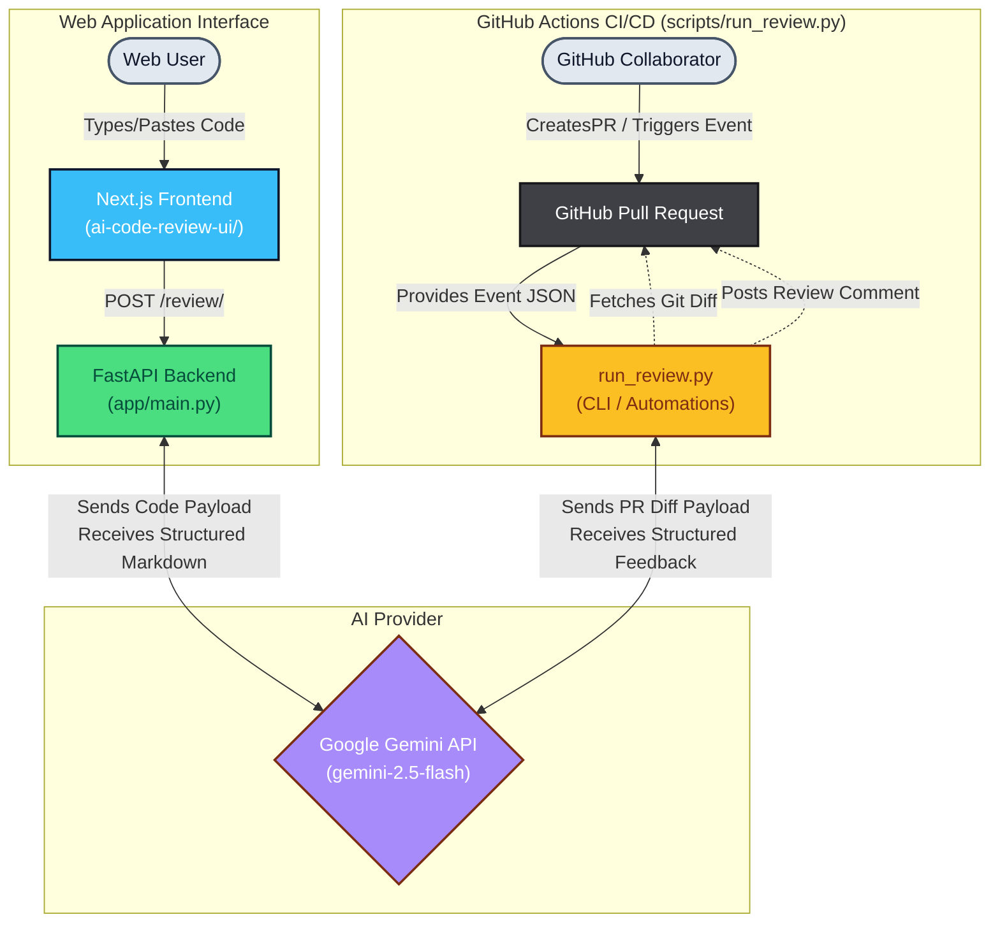

# AI Code Reviewer

An intelligent code review assistant powered by Google Gemini AI that provides detailed feedback on your code like a senior software engineer. Features a modern Next.js UI with Monaco code editor, real-time status indicators, and structured review output.


## Features

| Feature | Description |
|---------|-------------|
<<<<<<< HEAD
| **Monaco Code Editor** | Syntax-highlighted editor with drag-and-drop file upload support |
| **AI-Powered Reviews** | Google Gemini analysis for bugs, security vulnerabilities, performance issues, and code smells |
| **Structured JSON Output** | Tabbed review interface categorized by severity and type (Bugs, Security, Performance, etc.) |
| **Real-time Streaming** | Live Server-Sent Events (SSE) streaming of AI responses |
| **Apply Fix Capability** | One-click application of AI-suggested code fixes with inline diff viewer |
| **Responsive UI** | Next.js 14+ with Tailwind CSS and shadcn/ui components |
| **API-Driven** | FastAPI backend with SSE streaming and JSON schema enforcement |
| **CLI Support** | Additional `scripts/run_review.py` for terminal usage |

## Functionality

1. **Code Input**: Drag and drop a file or paste code into the Monaco editor.
2. **Submit Review**: Frontend sends code to FastAPI `/review/stream` endpoint.
3. **AI Processing**: Backend streams the response using Server-Sent Events (SSE) from Google Gemini.
4. **Display Results**: Frontend renders the real-time stream, then parses it into categorized tabs (Bugs, Security, Performance, Practices, Positives).
5. **Apply Fixes**: Users can click "Apply Fix" to automatically merge AI-suggested code replacements directly into the editor.
=======
| **Monaco Code Editor** | Syntax-highlighted editor supporting multiple languages (Python, JS/TS, Java, etc.) |
| **AI-Powered Reviews** | Google Gemini analysis for bugs, security vulnerabilities, performance issues, and code smells |
| **Best Practices** | Industry-standard recommendations with explanations and fixes |
| **Structured Output** | Markdown-formatted reviews categorized by severity and type |
| **Real-time Status** | Live progress indicators during analysis |
| **Responsive UI** | Next.js 14+ with Tailwind CSS and shadcn/ui components |
| **API-Driven** | FastAPI backend with health checks and CORS support |
| **CLI Support** | Additional `scripts/run_review.py` for terminal usage |
| **Fast Responses** | Gemini 2.0 Flash model (~2-5s average) |

## Functionality

1. **Code Input**: Paste or type code in the Monaco editor.
2. **Submit Review**: Frontend sends code + language to FastAPI `/review/` endpoint.
3. **AI Processing**: Backend calls Google Gemini API with optimized prompt for structured feedback.
4. **Display Results**: Frontend renders review in categorized sections (Bugs, Security, Performance, Refactoring).
5. **Copy/Export**: Easy copy-to-clipboard for reviewed code suggestions.
>>>>>>> 0f7f906314685faf0888799d6f21d52d0b7d3c5e

## Screenshots

### Main Interface
The clean, intuitive interface makes code review simple and efficient.

### Review Output
Detailed, structured feedback covering bugs, security, performance, and best practices.

## System Architecture



**Key Components**:
- **Frontend (Web)**: Next.js 14+ (`page.tsx`), Tailwind CSS 4, shadcn/ui. Handles manual code uploads/inputs via a custom Monaco-like textarea.
- **Backend (Web API)**: FastAPI (`app/main.py`), Pydantic models. Services incoming HTTP requests and proxies them to the Gemini API securely.
- **CI/CD Integration**: `scripts/run_review.py` triggers on GitHub PRs, automatically pulling file diffs and submitting them directly to Gemini via API, then posting automated feedback comments.
- **AI Engine**: Google Gemini API (`gemini-2.5-flash`), configured to act as a senior engineer providing comprehensive static code analysis across various languages.

**Data Flow Details**:
1. **Web Flow**:
<<<<<<< HEAD
   - User inputs code via drag-and-drop or typing in the Web UI.
   - Frontend triggers a `POST` request to the backend `/review/stream` endpoint.
   - Backend constructs an optimized structured JSON prompt and streams the Google Gemini API response via SSE.
   - Frontend parses the JSON stream and renders a tabbed interface with inline code annotations and apply-fix diffs.
=======
   - User inputs code + selects language in the Web UI.
   - Frontend triggers a `POST` request to the backend `/review/` endpoint.
   - Backend constructs an optimized code review prompt and queries the Google Gemini API.
   - Response is parsed and rendered locally in the browser utilizing markdown elements.
>>>>>>> 0f7f906314685faf0888799d6f21d52d0b7d3c5e
2. **Automated CI Flow**:
   - Developer opens a Pull Request on GitHub.
   - GitHub Actions workflow injects event context into `run_review.py`.
   - Script retrieves the PR differ using the GitHub REST API and patches it to Gemini.
   - Resulting code review is posted straight back into the Pull Request as a comment.

**Tech Stack**:
| Layer | Technologies |
|-------|--------------|
<<<<<<< HEAD
| Frontend | Next.js 14+, React 19, Tailwind CSS 4, Monaco Editor, react-dropzone, shadcn/ui |
| Backend | FastAPI, Python 3.11+, uvicorn, httpx, sse-starlette, Pydantic |
| AI | Google Gemini 2.5 Flash |
| Utils | dotenv (.env), CORS middleware, logging |
=======
| Frontend | Next.js 14+, React 19, Tailwind CSS 4, shadcn/ui, lucide-react |
| Backend | FastAPI, Python 3.11+, uvicorn, Pydantic |
| AI | Google Gemini 2.5 Flash |
| Utils | dotenv (.env), CORS middleware, logging
>>>>>>> 0f7f906314685faf0888799d6f21d52d0b7d3c5e

## Quick Start

### Prerequisites

- Python 3.8 or higher
- Node.js 18 or higher
- Google Gemini API Key ([Get one here](https://aistudio.google.com/apikey))

### Backend Setup (app/)

1. **Activate virtual env** (create if needed: `python -m venv venv`, then `venv\Scripts\activate` on Windows)
2. **Install deps**: `pip install -r requirements.txt`
3. **Copy `.env.example` to `.env`** and add `GEMINI_API_KEY=your_key`
4. **Run server**: `uvicorn app.main:app --reload --host 0.0.0.0 --port 8000`

API docs at http://localhost:8000/docs

### Frontend Setup (ai-code-review-ui/)

1. **Navigate**: `cd ai-code-review-ui`
2. **Install deps**: `npm install`
3. **Run dev server**: `npm run dev`

Open http://localhost:3000. Ensure backend runs on :8000 first (update API_URL in code if needed).

## Project Structure

```
<<<<<<< HEAD
AI Code Reviewer/                 # Root: d:/College/RCCIIT/Projects/AI Code Reviewer
=======
AI Code Reviewer/                 # Root
>>>>>>> 0f7f906314685faf0888799d6f21d52d0b7d3c5e
├── app/                          # FastAPI Backend
│   └── main.py                   # Main API server (/review/, /health)
├── ai-code-review-ui/            # Next.js 14 Frontend
│   ├── app/
│   │   ├── page.tsx              # Main review page
│   │   ├── layout.tsx            # Root layout
│   │   └── globals.css           # Tailwind styles
│   ├── components/
│   │   ├── CodeEditor.tsx        # Monaco code input
│   │   ├── ReviewDisplay.tsx     # Review output renderer
│   │   ├── StatusIndicator.tsx   # Loading/Status UI
│   │   └── ui/                   # shadcn/ui (button, card, etc.)
│   ├── lib/
│   │   └── utils.ts              # Shared utilities (cn function)
│   ├── public/                   # Static assets (icons)
│   └── package.json              # Next.js deps (next@14+, tailwind, etc.)
├── scripts/
│   └── run_review.py             # CLI code review script
├── requirements.txt              # Backend deps (fastapi, uvicorn, etc.)
├── .gitignore
├── .env.example                  # GEMINI_API_KEY template
└── README.md
```

## Configuration

### Backend Configuration

Edit `app/main.py` to customize:

```python
# Change the AI model
MODEL_NAME = "gemini-2.5-flash"  

# Adjust generation parameters
"generationConfig": {
    "temperature": 0.4,      # Lower = more focused
    "maxOutputTokens": 4096, # Max response length
    "topP": 0.95,
    "topK": 40
}

# CORS settings for production
allow_origins=[
    "http://localhost:3000",
    "https://your-domain.com"  # Add your domain
]
```

### Environment Variables

| Variable | Description | Required |
|----------|-------------|----------|
| `GEMINI_API_KEY` | Your Google Gemini API key | Yes |

## API Documentation

### Endpoints

#### `GET /`
Health check endpoint
```json
{
  "message": "AI Code Review Bot API",
  "version": "1.0.0",
  "model": "gemini-1.5-flash"
}
```

#### `GET /health/`
Service health status
```json
{
  "status": "healthy",
  "model": "gemini-2.5-flash"
}
```

#### `POST /review/`
Submit code for review

**Request Body:**
```json
{
  "code": "def add(a, b):\n    return a + b",
  "language": "python"  // optional
}
```

**Response:**
```json
{
  "review": "## Code Review...",
  "success": true,
  "token_count": 1234
}
```

**Error Response:**
```json
{
  "detail": "Error message here"
}
```

## Usage Examples

### Python Function Review
```python
def calculate_average(numbers):
    total = 0
    for num in numbers:
        total += num
    return total / len(numbers)
```

### JavaScript Code Review
```javascript
function fetchUserData(userId) {
    const response = fetch(`/api/users/${userId}`);
    return response.json();
}
```

### Git Diff Review
```diff
- const data = response.json();
+ const data = await response.json();
```

## Development

### Running Tests
```bash
# Backend tests
pytest

# Frontend tests
npm test
```

### Code Formatting
```bash
# Python
black app/
isort app/

# Frontend
npm run format
```

### Building for Production

**Backend:**
```bash
gunicorn app.main:app --workers 4 --worker-class uvicorn.workers.UvicornWorker --bind 0.0.0.0:8000
```

**Frontend:**
```bash
npm run build
npm start
```

## Docker Deployment

```dockerfile
# Dockerfile for backend
FROM python:3.11-slim

WORKDIR /app
COPY requirements.txt .
RUN pip install --no-cache-dir -r requirements.txt

COPY app/ ./app/
EXPOSE 8000

CMD ["uvicorn", "app.main:app", "--host", "0.0.0.0", "--port", "8000"]
```

```yaml
# docker-compose.yml
version: '3.8'
services:
  backend:
    build: .
    ports:
      - "8000:8000"
    environment:
      - GEMINI_API_KEY=${GEMINI_API_KEY}
  
  frontend:
    build: ./frontend
    ports:
      - "3000:3000"
    depends_on:
      - backend
```

## Contributing

Contributions are welcome! Please follow these steps:

1. Fork the repository
2. Create a feature branch (`git checkout -b feature/amazing-feature`)
3. Commit your changes (`git commit -m 'Add amazing feature'`)
4. Push to the branch (`git push origin feature/amazing-feature`)
5. Open a Pull Request


## Acknowledgments

- [Google Gemini](https://ai.google.dev/) for the powerful AI model
- [FastAPI](https://fastapi.tiangolo.com/) for the excellent Python framework
- [Next.js](https://nextjs.org/) for the React framework
- [Shadcn UI](https://ui.shadcn.com/) for the beautiful components
- [Tailwind CSS](https://tailwindcss.com/) for the styling utilities


## Roadmap

- [ ] Support for more AI models (Claude, GPT-4)
- [ ] GitHub integration for PR reviews
- [ ] VS Code extension
- [ ] Batch file review
- [ ] Custom review templates
- [ ] Team collaboration features
- [ ] Review history and analytics

## Limitations

- Maximum code length: 10,000 characters per request
- Rate limits apply based on your Gemini API tier
- Some languages may receive better reviews than others
- AI-generated feedback should be validated by human developers

## Performance

- Average response time: 2-5 seconds
- Supports concurrent requests
- Token usage: ~500-2000 tokens per review
- Uptime: 99.9% (dependent on Gemini API)

---

Made with ❤️ by Subhajit
